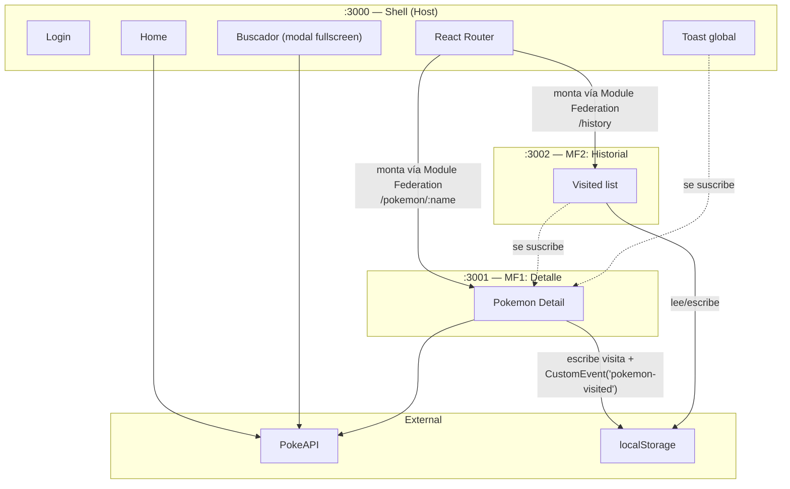

# Arquitectura

## Las 3 apps



Cada app es un proyecto Vite + React + TS independiente, orquestado desde la raíz con pnpm workspaces + Turborepo (ver [`adr/001`](./adr/001-monorepo-pnpm-turborepo.md)). El Shell es el único **host** de Module Federation; MF1 y MF2 son **remotes** que exponen un componente de entrada cada uno (ver [`adr/002`](./adr/002-module-federation-vite.md)).

## Principio rector: los MFs son standalone

Cada MF debe poder levantarse solo (`pnpm --filter mf1 dev` en :3001) y funcionar sin el Shell:

- **MF1** recibe el nombre/id del Pokémon por **route param** (`/pokemon/:name`), no por props inyectadas desde el host. Hace su propio fetch a PokeAPI.
- **MF2** no recibe nada del host — lee su estado completo de `localStorage`.

Esto es deliberado: evita compartir un store en runtime entre bundles federados (frágil, acopla versiones — ver [`adr/003`](./adr/003-cross-mfe-communication.md)) y hace que cada MF sea evaluable de forma aislada, que es justamente lo que "buen uso de microfrontends" (30% del puntaje) está midiendo.

## Comunicación cross-MFE

No hay un store de Zustand compartido entre bundles. La comunicación pasa por dos canales nativos del browser, ambos desacoplados de versión de build:

1. **URL / routing** — Shell → MF1: qué Pokémon mostrar.
2. **`localStorage` + `CustomEvent('pokemon-visited')`** — MF1 → (MF2, Shell): "se visitó este Pokémon". MF2 lo usa para refrescar su lista sin recargar; el Shell lo usa para disparar el toast.

Detalle completo de esta decisión y las alternativas descartadas (Module Federation `shared` singleton, prop drilling desde el host, mensajería `postMessage`) en [`adr/003`](./adr/003-cross-mfe-communication.md).

## Theme cross-app

El tema (claro/oscuro) se resuelve seteando una clase (`dark`) en `document.documentElement`, persistida en `localStorage`. Como los 3 bundles renderizan en el mismo documento HTML, todos heredan las mismas CSS variables de Tailwind sin necesitar un `ThemeContext` de React compartido entre remotes — solo hace falta que los 3 proyectos usen la misma config de Tailwind (tokens compartidos vía `packages/shared`, ver [`adr/004`](./adr/004-styling-tailwind.md)).

## Data fetching por app

Cada app tiene su propio `QueryClient` de TanStack Query (ver [`adr/006`](./adr/006-data-fetching-tanstack-query.md)) — no se comparte cache entre bundles federados por la misma razón que no se comparte store: acoplaría el ciclo de vida de una app al de otra. El costo (una request duplicada si el usuario visita el mismo Pokémon vía Home y luego vía Historial) es aceptable frente al beneficio de desacoplamiento total.

## Estructura de carpetas del monorepo

```
reto_tecnico_frontend_senior/
├── apps/
│   ├── shell/       # :3000 — host
│   ├── mf1-detail/  # :3001 — remote
│   └── mf2-history/ # :3002 — remote
├── packages/
│   └── shared/      # tipos de Pokemon, cliente PokeAPI, tokens de Tailwind, utils de localStorage/eventos
├── docs/
├── turbo.json
├── pnpm-workspace.yaml
└── package.json
```

`packages/shared` no se federa en runtime — se consume en **build time** (cada app lo importa como dependencia de workspace y lo bundlea). Solo se comparte código fuente, nunca estado en memoria. Esto mantiene la regla de "MFs standalone" sin duplicar definiciones de tipos o la lógica de fetch a PokeAPI.
